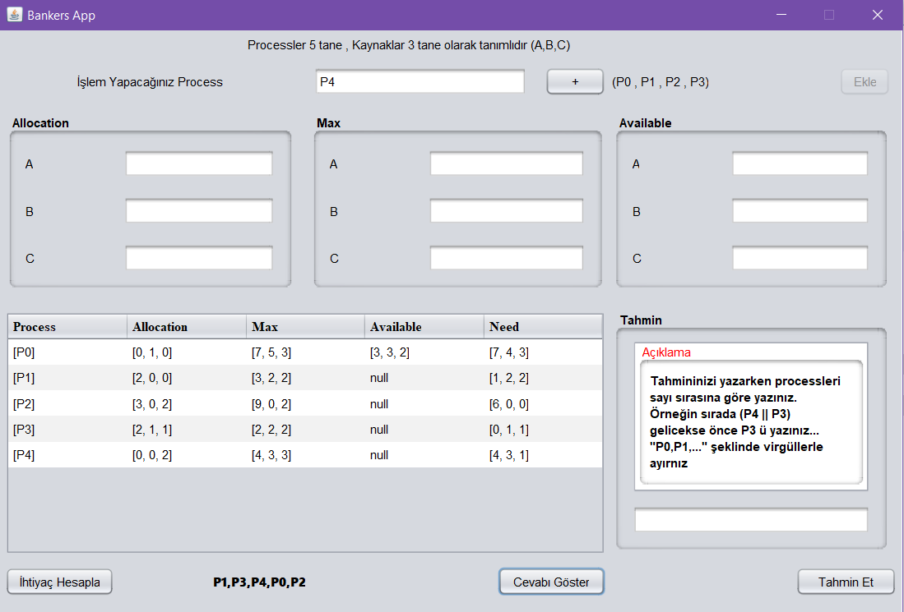

# Banker-s-Algoritmas-Java

Java da Jframe penceresiyle banker's algoritmasının uygulanması.

Kullanıcı sırasıyla process ve kaynakları tablolara ekler.
ihtiyaç hesaplanır.
Banker's algoritması uygulanır ve cevap elde tutulur.
Kullanıcı sonucu tahmin etmeye çalışır.

->Tabloya girilen değerler matrislerde tutulur ve o matrisler üzerinden işlem yapılır
Sırasıyla tüm tabloların değerleri aktarılır ve need matrisi hesaplanır(ihtiyaç=max-Atanmış).
Kullanıcı zaten yanlış bi işlem yapamaz çünkü işlemler sırasıyla ilerlemektedir.
Matrislerin hesbaından sonra değerler bankers algoritmasına uğrar ve görevler için
bir çalışma sırası belirlenir.Eğer kullanılabilir kaynak sayısı ihtiyaç olunan kaynak sayısını karşılıyorsa
deadlock yoktur ve o process işlemi yapar.Ardından işlemi yapılan process artık sistemi yormucağı için
kullandığı kaynak sayıları da kullanılabilir kaynak sayısına eklenir ve tüm process ler bu şekilde denenir.
Eğer process kalmışsa ve ihtiyaç karşılanmıyorsa ana algoritma işlemi yapılmadan çıkar ve kontrol sonucu unsafe olduğu bildirilir.

Algoritma sonucu oluşan sıralama bir değişkende tutulur ve kullanıcının tahminiyle kontrol edilir
Tahmin sonucu tekrar ekranda pencere açılıp kullanıcıya bildirilir.
Ve sonucu görmek istemeden cevabı görmez tahmin etmeye devam eder 
